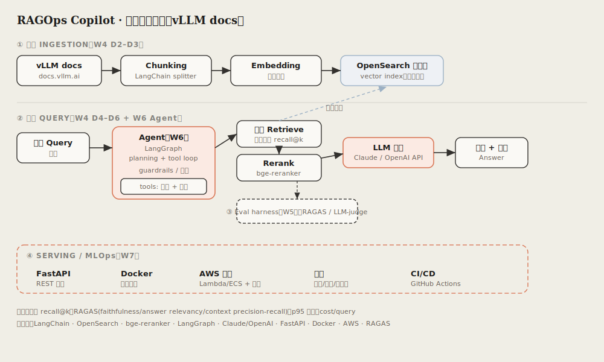

# RAGOps Copilot

> A production-grade RAG (later + Agent) assistant over the **vLLM documentation**.
> Ask a question → retrieve relevant doc chunks → (rerank) → LLM answers **with citations** →
> retrieval quality is **measured** (recall@k, later RAGAS). The focus is production engineering —
> evaluation, serving, monitoring — **not** a notebook chatbot.

**Why vLLM docs?** This is *Project 1* of a two-project arc. Project 2 is a vLLM / LLM-serving
optimization platform. The narrative: first build a RAG assistant that answers questions *about*
vLLM, then build the infra that *serves and optimizes* vLLM — using this RAG app as a real workload.

## Architecture



Two stages:
- **① Offline ingestion** — vLLM docs → chunk → embed → index in OpenSearch.
- **② Online query** — question → semantic retrieval → (rerank) → LLM generation with citations.
- **③ Eval harness** (side) and **④ Serving/MLOps** (outer) come in later weeks.

## Key decisions (W4 D1, locked)

| Decision | Choice | Why |
|---|---|---|
| Corpus | **vLLM official docs** (cloned from the GitHub `docs/` source) | Clean Markdown/RST, pinnable to a git SHA, idempotent re-ingestion vs. crawling HTML |
| Embeddings | **`BAAI/bge-small-en-v1.5`** (sentence-transformers) | Local + free on the RTX 5080, reproducible, strong on English technical docs |
| Vector store | **OpenSearch** (local Docker) | Existing strength; AWS deployment deferred to W7 |
| LLM (generation) | **Anthropic / Claude** | Citation-faithful answering; wired in at W4 D4 |
| Retrieval metric | **recall@1 / recall@3 / recall@5** | Core measure of retrieval quality, reproducible from a fixed eval set |

## Tech stack

LangChain (splitters/retriever) · OpenSearch (vector index) · sentence-transformers (bge-small) ·
bge-reranker (W4 D5) · Anthropic Claude (generation) · RAGAS (W5) · LangGraph (W6) ·
FastAPI / Docker / AWS (W7).

## Repo layout

```
src/         ingestion (load/clean/chunk/embed) + retrieval + (later) generation
eval/        eval set (hand-written) + metric scripts (recall@k)
data/        corpus + index data — GITIGNORED
docs/        architecture diagram, design notes
notebooks/   exploration
```

## Roadmap

| Week | Milestone |
|---|---|
| **W4** | Retrieval baseline: ingest → chunk → embed → OpenSearch → semantic retrieval → **recall@1/3/5**. Reranker added D5. |
| **W5** | Eval harness: RAGAS (faithfulness / answer relevancy / context precision-recall) + LLM-as-judge. |
| **W6** | Agent layer: LangGraph planning + tool loop + guardrails. |
| **W7** | Serving & MLOps: FastAPI · Docker · AWS · monitoring (latency / cost / failure rate) · CI/CD. |

## How to run

Prerequisites: **Python 3.11**, [`uv`](https://docs.astral.sh/uv/), and (from W4 D2) Docker for a
local OpenSearch. Runs on WSL2 + RTX 5080 (CUDA) or Mac.

```bash
# install dependencies into a local .venv
uv sync

# copy the env template and fill in your keys
cp .env.example .env        # then edit: ANTHROPIC_API_KEY, OpenSearch creds

# (W4 D2+) ingestion / retrieval entry points land in src/ as the pipeline is built
uv run python -m src.<module>
```

## Success criterion (W4)

For 20–30 hand-written questions about vLLM, the system retrieves the relevant chunk(s) and reports
**recall@1 / recall@3 / recall@5** — reproducibly, from a fixed eval set.

---

*This is a learning project built incrementally on a fixed daily plan — see `CLAUDE.md` for the
working agreement and scope guardrails.*
