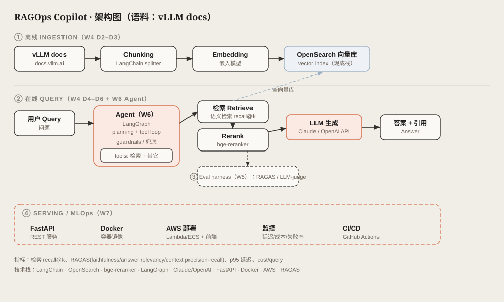

# RAGOps Copilot

[](https://github.com/Ezreal222/ragops-copilot/actions/workflows/ci.yml)

> A production-grade RAG (and Agent) assistant over the **vLLM documentation**.
> Ask a question → retrieve relevant doc chunks → (rerank) → LLM answers **with citations** →
> retrieval quality is **measured** (recall@k, then RAGAS). The focus is production engineering —
> evaluation, serving, monitoring — **not** a notebook chatbot.

**Why vLLM docs?** The corpus pairs with a companion project on vLLM / LLM-serving optimization:
this assistant answers questions *about* vLLM, while the serving work optimizes the infrastructure
that *runs* vLLM — using this RAG app as a realistic workload. Together they cover both building an
LLM application and making it efficient.

## Architecture



- **① Offline ingestion** — vLLM docs → chunk → embed → index in OpenSearch.
- **② Online query** — question → `answer()` unified entrypoint → semantic retrieval → (rerank) →
  LLM generation with citations. An **agent** tool loop (LangGraph ReAct + guardrails) is wired as
  an alternate engine behind the `use_agent` switch (default off — see [Results (W6 agent)](#results-w6-agent)).
- **③ Eval harness** (side) covers recall@k, RAGAS, and agent eval. **④ Serving / MLOps** (outer) is the next phase.

## Design decisions

| Decision | Choice | Why |
|---|---|---|
| Corpus | **vLLM official docs** (cloned from the GitHub `docs/` source) | Clean Markdown/RST, pinnable to a git SHA, idempotent re-ingestion vs. crawling HTML |
| Embeddings | **`BAAI/bge-small-en-v1.5`** (sentence-transformers) | Runs locally on CPU/GPU, reproducible, strong on English technical docs |
| Vector store | **OpenSearch** (local Docker) | Mature hybrid lexical + vector search; managed deployment is a later, serving-phase concern |
| LLM (generation) | **DeepSeek `deepseek-v4-pro`** (OpenAI-compatible) | Citation-faithful answering; provider-agnostic via `LLMConfig` — swap to OpenAI/Anthropic by config, not code |
| Retrieval metric | **recall@1 / recall@3 / recall@5** | Core measure of retrieval quality, reproducible from a fixed eval set |

## Tech stack

LangChain (splitters/retriever) · OpenSearch (vector index) · sentence-transformers (bge-small) ·
bge-reranker (cross-encoder) · DeepSeek (generation, OpenAI-compatible) · RAGAS · LangGraph · FastAPI · Docker · AWS.

## Repo layout

```
src/         ingestion (load/clean/chunk/embed) + retrieval + generation + agent
src/api/     FastAPI service — /ask, /health, startup preloading
eval/        eval set + metric scripts (recall@k)
data/        corpus + index data — GITIGNORED
docs/        architecture diagram, design notes
notebooks/   exploration
```

## Roadmap

| Phase | Milestone |
|---|---|
| **1 · Retrieval** ✅ | Ingest → chunk → embed → OpenSearch → semantic retrieval → **recall@1/3/5** + cross-encoder reranker + end-to-end LLM answers with citations. **Done (W4)** — see [Results](#results-w4-retrieval-baseline). |
| **2 · Evaluation** ✅ | RAGAS (faithfulness / answer relevancy / context precision-recall) + LLM-as-judge + chunking & retrieval/rerank ablations. **Done (W5)** — see [Results](#results-w5-evaluation--tuning). |
| **3 · Agent** ✅ | LangGraph ReAct tool loop (`search_docs` / `list_sources` / `compare`) + guardrails (step cap, tool retry/fallback, low-score refusal, citation check) + agent eval + a unified `answer()` entrypoint with a `use_agent` degrade switch. **Done (W6)** — see [Results](#results-w6-agent). |
| **4 · Serving & MLOps** | **FastAPI ✅ (W7 D1)** — `/ask` + `/health`, Swagger, startup preloading, latency instrumentation. **Docker ✅ (W7 D2)** — multi-stage image (2.53 GB, CPU torch, non-root) + `docker compose up` for API&nbsp;+&nbsp;OpenSearch. Next: AWS · monitoring (latency / cost / failure rate) · CI/CD. |

## Results (W4 retrieval baseline)

Measured on a **fixed eval set of 20 hand-written questions** (gold `chunk_id`s labeled
independently of the retriever, via keyword search in `eval/find_chunks.py`) over a corpus of
~2,700 chunks. `chunk-level` recall requires the exact gold chunk; `doc-level` counts any chunk
from the same source document (`chunk_id.split("::")[0]`).

| recall@k | baseline (bi-encoder) chunk / doc | + reranker chunk / doc |
|---|---|---|
| @1 | 0.20 / 0.55 | **0.35** / 0.55 |
| @3 | 0.60 / 0.85 | 0.60 / **0.90** |
| @5 | 0.80 / **1.00** | 0.65 / 0.95 |
| @10 | 0.80 / **1.00** | 0.75 / 0.95 |
| latency / query | mean 38 ms / median 8 ms | mean 95 ms / median 65 ms |

**What the numbers say:**
- Baseline **recall@1 low (0.20) but recall@5 high (0.80)** → relevant content *is* retrieved,
  just not ranked first — exactly the gap a reranker exists to close.
- The cross-encoder reranker lifts **chunk recall@1 0.20 → 0.35** (+75% relative): its real payoff
  here is **ranking precision**, not coverage.
- Document-level recall is already **saturated (recall@5 = 1.00)** for the bi-encoder, so the
  reranker has no recall headroom — it can only reshuffle, occasionally pushing a gold doc out
  (doc@5 1.00 → 0.95). A textbook case of *"a reranker isn't worth it when recall is already
  saturated"*, at ~2.5× the latency.
- The chunk-vs-doc gap is largely a **labeling artifact** (gold pinned to overview `::0` chunks);
  W5 will move to multi-gold / document-level recall on a larger, non-saturated corpus.

**End-to-end (generation).** `ask()` runs retrieve → (rerank) → DeepSeek, returning
an answer with inline `[n]` citations mapped back to real sources. It **refuses rather than
hallucinates** — out-of-corpus questions ("Can vLLM make coffee?") and genuine retrieval misses
both return *"I couldn't find this in the vLLM docs."*, demonstrating that generation quality is
bounded by retrieval. (Reranking was on at W4; the W5 D6 ablation below turned it **off** by default.)

## Results (W5 evaluation & tuning)

Two ablation studies turned retrieval quality into **decisions**, measured with **RAGAS**
(context precision/recall, faithfulness, answer relevancy; judge = DeepSeek `deepseek-v4-flash`,
temperature 0) over an upgraded, **document-level** eval set (multi-gold references; 32 answerable
questions). Every study changes **one variable at a time** so each metric delta is attributable.

> **Full write-up:** [`docs/eval_report.md`](docs/eval_report.md) — method, RAGAS baseline,
> custom-judge agreement, both ablations, the reranker negative result, and the recommended config.

**Chunking (D5).** Sweeping chunk_size/overlap, **1200/200** beat the old 800/100 baseline on
*both* context_recall (0.69 → 0.79) and context_precision (0.69 → 0.76) while shrinking the index
(2,700 → 1,783 chunks). Adopted as the corpus default. (`eval/ablation_chunking.csv`)

**Retrieval / rerank (D6)** — on the 1200/200 corpus, varying one query-time knob at a time:

| config | recall@1 | recall@k | ctx precision | ctx recall | faithfulness | answer rel. | latency |
|---|---|---|---|---|---|---|---|
| **baseline** — k=5, no rerank | 0.594 | 0.844 | **0.777** | 0.786 | 0.844 | 0.829 | 19 ms |
| k=3, no rerank | 0.594 | 0.781 | 0.763 | 0.625 | – | – | 9 ms |
| k=10, no rerank | 0.594 | **0.969** | 0.712 | **0.823** | **0.863** | **0.865** | 11 ms |
| + rerank (N=50) | 0.438 | 0.906 | 0.700 | 0.703 | 0.786 | 0.832 | 94 ms |
| + rerank (N=20) | 0.438 | 0.906 | 0.753 | 0.719 | – | – | 40 ms |
| + rerank (N=100) | 0.406 | 0.875 | 0.682 | 0.672 | – | – | 146 ms |

`recall@k` is measured at each config's own `k` (so the k=3 row is recall@3); generation metrics
(`–`) were run only on the 3 representative configs to bound LLM cost. (`eval/ablation_retrieval.csv`)

**Decisions:**
- **Reranker off — a clean negative result.** The cross-encoder lost on *every* metric — recall@1
  (0.594 → 0.438), both context metrics, and faithfulness — at **5–8× the latency**, and a deeper
  candidate pool (N=100) was strictly worst. On a near-saturated doc corpus its reordering demotes
  the gold doc rather than surfacing new evidence; a stronger repeat of the W4 finding. Removed from
  the production `ask()` path (`config.use_reranker=False`).
- **top_k = 5 — the balanced default.** Best context_precision at half the token cost of k=10.
  **k=10** is documented as a **recall-max** option (recall@k 0.844 → 0.969, best end-to-end
  faithfulness/answer_relevancy) for when coverage outweighs the ~2× token cost — but with n=32 the
  quality gains sit within noise, so the cheaper, higher-precision k=5 stays the default.

The quality–latency–cost triangle in one table: every knob (k, rerank, N) moves quality *and*
cost/latency together; the production config is the highest-quality point **under the cost/latency
budget**, not the maximum on any single metric.

## Results (W6 agent)

W6 turns the fixed pipeline into an **agent**: a LangGraph ReAct loop where the LLM *decides*
which tool to call (`search_docs`, `list_sources`, `compare`) instead of always retrieving once.
Four **guardrails** keep the free-running loop safe — a step cap with graceful fallback, tool
retry/`safe_tool` backstop, a relevance-score refusal threshold, and an output citation check. An
**agent eval** set (10 tasks) scores not just the answer but the *process* (tool choice, steps,
degradation).

A unified entrypoint **`src/answer.py :: answer()`** routes every question to the agent *or* the
fixed pipeline via `SERVING.use_agent`, returning one shape
(`{answer, citations, tool_trace, steps, contexts, mode, degraded}`) for the frontend / eval / monitoring.

> **Full write-up:** [`docs/agent.md`](docs/agent.md) — the ReAct graph, tool list, all four
> guardrails (with the 0.82 threshold basis), the agent eval table, and a multi-step trace demo.

**Regression before trusting the agent as default** (`eval/compare_agent_vs_rag.py`, both engines
over the 36-question eval set, RAGAS judge = DeepSeek `deepseek-v4-flash`, temp 0):

| metric | fixed RAG | agent | Δ (agent−rag) |
|---|---|---|---|
| faithfulness | 0.723 | 0.695 | −0.027 |
| answer_relevancy | 0.697 | 0.639 | −0.058 |
| context_precision | 0.776 | 0.525 | **−0.251** |
| context_recall | 0.708 | 0.616 | −0.093 |
| refusal_acc | 0.833 | 0.778 | −0.056 |

- A **tool-use-policy** prompt fix (retrieve once, then answer — no reworded re-searches) cut the
  agent's average tool-call rounds **8.0 → 2.8** and non-convergence from 3/3 (smoke) to **8/36**.
- **Decision:** the agent reaches near-parity on faithfulness / answer_relevancy / refusal_acc
  (~0.03–0.06, within noise at n=36) but **still degrades** on context_precision (−0.25) and leaves
  **22% of questions** at the step-cap fallback. So the runtime default stays **`use_agent=False`**
  (fixed RAG); the agent is the architectural entrypoint but ships **behind the flag** until
  convergence improves — regression-driven progressive rollout: *if it degrades, you don't flip the
  default.* (`eval/compare_agent_vs_rag.csv`)

## Results (W7 D6 · latency & cost optimization)

**Profile before you optimize.** `eval/profile_latency.py` decomposes one `/ask` into its
stages (8 eval questions, `top_k=5`, `deepseek-v4-pro`):

| stage | mean | share |
|---|---|---|
| embed | 7.7 ms | 0.1% |
| k-NN | 5.1 ms | 0.1% |
| **LLM generation** | **9,743 ms** | **99.9%** |
| total | 9,756 ms (p95 ~13 s) | |

The LLM call is **763× the entire retrieval path** and ~all of the $0.00116/query cost
(prompt 1488 tok = 35%, completion 691 tok = 65% — `deepseek-v4-pro` is a *thinking* model, so
hidden reasoning tokens bill as completion). This kills the instinct to "put the embedder on a
GPU": that 6 ms is 0.06% of the wall. **Every optimization below targets the LLM side.**

Three levers, each measured before/after with a quality guard:

| lever | latency | $/query | quality | verdict |
|---|---|---|---|---|
| baseline (`k=5`, rag) | p95 ~13 s | $0.00116 | recall@5 **0.688** | — |
| ① `top_k` 5→3 | ~unchanged¹ | **$0.00088 (−24%)** | recall@3 **0.625 (−6.3pt)** | ❌ **reject** |
| ② response cache (hit) | **0.03 ms** | **$0** | identical answer | ✅ **ship** |
| ③ agent vs rag | agent **1.9× slower** | agent **2.5×** ($0.00216) | — | ✅ keep rag default |

¹ latency is completion-bound, so shrinking the prompt barely moves it — the k=3 win is purely
cost, and not worth losing 6 points of retrieval coverage on an already-$0.001 query.

- **① Lower `top_k` — rejected (honest negative).** k=3 cuts prompt tokens 38% and cost 24%, but
  drops recall@k 0.688 → 0.625 (`eval.eval_retrieval`). For a grounding-critical docs assistant
  that trade is bad; **`top_k` stays 5** (also the W5 ablation optimum).
- **② Response cache — shipped.** An exact-match, normalized-key LRU+TTL cache
  (`src/cache.py`, `CacheConfig`) turns a repeat question from a ~6 s, paid LLM round-trip into a
  **0.03 ms, $0** dict lookup — a hit skips the whole pipeline. Case/whitespace variants collapse
  to one entry; `use_agent` and `k` are part of the key so a cached agent answer can't be served to
  a fixed-RAG request. Hit rate is exported as `ask_cache_total{result}`. Semantic (near-duplicate)
  matching is a noted next step, not a silent default. **On by default** (`CACHE.enabled=True`).
- **③ Agent premium — quantified.** Driving both engines over an identical question mix
  (`monitoring.generate_traffic`), the agent path costs **1.9× the latency and 2.5× the dollars**
  (3.4× prompt tokens — it re-feeds tool outputs every turn). That number *is* the justification for
  the `use_agent=False` default from W6: the agent isn't just a quality regression, it's a
  cost/latency one too.

**The discipline, not just the numbers:** measure first (retrieval was never the problem), keep
each change gated on the frozen eval set (don't buy speed with quality), and record the negative
result (k=3) as loudly as the win. Self-hosting a faster/cheaper model is the next lever — and the
bridge to Project 2 (vLLM serving), where the 99.9%-of-latency LLM call is exactly what gets
optimized. (`eval/profile_latency.py`, `src/cache.py`)

## How to run

### Quickstart: the whole system in one command (Docker)

Prerequisites: Docker with the **compose** and **buildx** plugins
(`sudo apt install docker-compose-v2 docker-buildx` on Ubuntu), plus a `.env` holding your
`DEEPSEEK_API_KEY`. Nothing else — no Python, no `uv`, no GPU.

```bash
cp .env.example .env          # then edit: DEEPSEEK_API_KEY

docker compose up -d --build  # OpenSearch + the API (~20s)

# A fresh cluster has no index, so /health honestly reports 503 until the corpus
# is loaded. Ingestion is idempotent — safe to re-run.
docker compose exec api python -m src.ingest      # ~90s on CPU (1783 chunks)

curl -s localhost:8000/health | jq                # → status "ok", indexed_chunks 1783
curl -s -X POST localhost:8000/ask \
  -H 'Content-Type: application/json' \
  -d '{"question":"What is PagedAttention?"}' | jq
#    → interactive docs (Swagger): http://localhost:8000/docs
```

The image is **2.53 GB** and runs as a non-root user. It installs the **CPU** build of torch
(`uv sync --group cpu`), so it ships no CUDA wheels, while a bare `uv sync` on the host still gets
the GPU build. That costs ~2ms per query — invisible beside the ~6s LLM call — but makes bulk ingest
~6× slower, which is why ingest is the one step worth running on a GPU. Model weights are **not**
baked into the image: bge-small downloads on first start into a cached volume.

Secrets are injected at run time from `.env` (which is in both `.gitignore` and `.dockerignore`) and
never enter an image layer.

### From source (development, GPU)

Prerequisites: **Python 3.11**, [`uv`](https://docs.astral.sh/uv/), and Docker (for the local
OpenSearch index). Runs on Linux/WSL or macOS; uses a CUDA GPU when available, otherwise CPU.

```bash
# install dependencies into a local .venv
uv sync

# copy the env template and fill in your keys
cp .env.example .env        # then edit: DEEPSEEK_API_KEY

# 1. ingest: load & clean vLLM docs → chunk → embed → bulk-index in OpenSearch (idempotent)
uv run python -m src.ingest

# 2. retrieval smoke test (semantic top-k for a couple of queries)
uv run python -m src.retrieve

# 3. eval: recall@1/3/5/10 over the fixed eval set; add --rerank for the before/after comparison
uv run python eval/eval_retrieval.py
uv run python eval/eval_retrieval.py --rerank

# 4. end-to-end RAG: retrieve → (rerank) → grounded answer with [n] citations
uv run python -m src.generate

# 5. evaluation (W5): RAGAS baseline + ablations (need DEEPSEEK_API_KEY for the judge)
uv run python -m eval.run_ragas                 # RAGAS four-metric baseline
uv run python -m eval.ablation_chunking         # chunk_size/overlap sweep → ablation_chunking.csv
uv run python -m eval.ablation_retrieval        # top_k / rerank / top_N sweep → ablation_retrieval.csv
uv run python -m eval.ablation_retrieval --no-ragas   # doc-recall + latency only (fast, no API cost)

# 6. agent (W6): unified entrypoint + agent tool loop + regression vs fixed RAG
uv run python -m src.answer                     # unified answer() — agent vs fixed RAG on one query
uv run python -m src.agent.graph                # live agent trace (tool loop + guardrail fault injection)
uv run python -m eval.eval_agent                # agent task success / tool-selection accuracy
uv run python -m eval.compare_agent_vs_rag --smoke 3   # regression wiring check (3 Qs)
uv run python -m eval.compare_agent_vs_rag      # full 36-Q agent-vs-RAG RAGAS comparison

# 7. serve (W7): the whole system as an HTTP API
uv run uvicorn src.api.main:app --reload --port 8000
#    → interactive docs (Swagger): http://localhost:8000/docs
curl localhost:8000/health
curl -X POST localhost:8000/ask -H 'Content-Type: application/json' \
  -d '{"question":"What is PagedAttention and what problem does it solve?"}'
```

### The API

| Endpoint | Purpose |
|---|---|
| `POST /ask` | `{question, use_agent?, k?}` → `{answer, citations, tool_trace, steps, mode, degraded, latency_ms}`. Grounded and cited; refuses when the docs don't cover the question. |
| `GET /health` | Readiness probe: is OpenSearch reachable, is the index non-empty, is the embedder loaded. Returns `503` when not ready. |

Heavy objects (embedder, OpenSearch client, LLM client, agent graph) are built **once** in the
lifespan startup hook and reused across requests — preloading costs ~1.8 s at boot and removes
~4.2 s of construction (plus a ~0.5 s first-encode CUDA warm-up) from every request. `use_agent`
defaults to the server's config (`SERVING.use_agent`), so the W6 degrade switch still governs
routing. Every request logs `mode / steps / degraded / refused / citations / latency_ms`.

## Success criterion

For 20–30 questions about vLLM, the system retrieves the relevant chunk(s) and reports
**recall@1 / recall@3 / recall@5** — reproducibly, from a fixed eval set.
